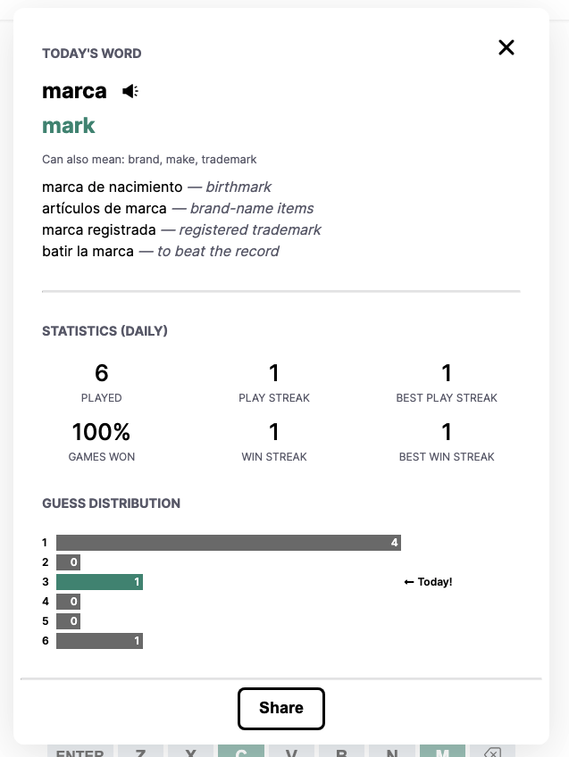

# Españordle

A daily word game for spanish learners.

## Overview

Españordle is a fully-featured wordle variation for Spanish learners.

After every game you will receive the translation, audio, and example uses of the word.

Españordle tracks your play streak as well as your win streak. The primary aim is not to win, but to gain new vocabulary, increase your exposure to spanish, and build a daily language learning habit.

There are two españordles released each day:
- Daily - vocab range from beginner to advanced (but nothing too obscure)
- Easy - a beginner-friendly mode limited to basic vocab

## About

Españordle is built with Next.js and Supabase. The audio and definitions are sourced primarily from the [Merriam-Webster Spanish-English Dictionary API](https://dictionaryapi.com/products/api-spanish-dictionary).
